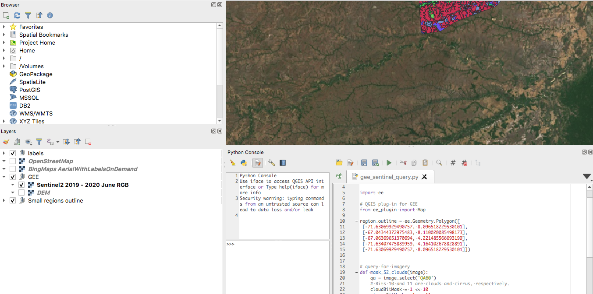

# QGIS recipes

Useful instructions for doing various operations in QGIS collected into one place.


## Adding a Bing Maps product as an XYZ tile layer

To move over from OneNote


## Adding a Google Earth Engine (GEE) queried map layer as an XYZ tile layer

Prerequisite: a GEE account. 

Installation and authentication instructions:
https://gee-community.github.io/qgis-earthengine-plugin/

In QGIS' Python Console or Editor, start with 

```python
import ee
from ee_plugin import Map
```

The result of a `Map.addLayer()` call will add the result as an XYZ tile layer to the current project. The name of the layer will be the name you designated in the `Map.addLayer()` call.

The following screenshot shows running a script to add a Sentinel-2 median composite over a time period as a layer.



